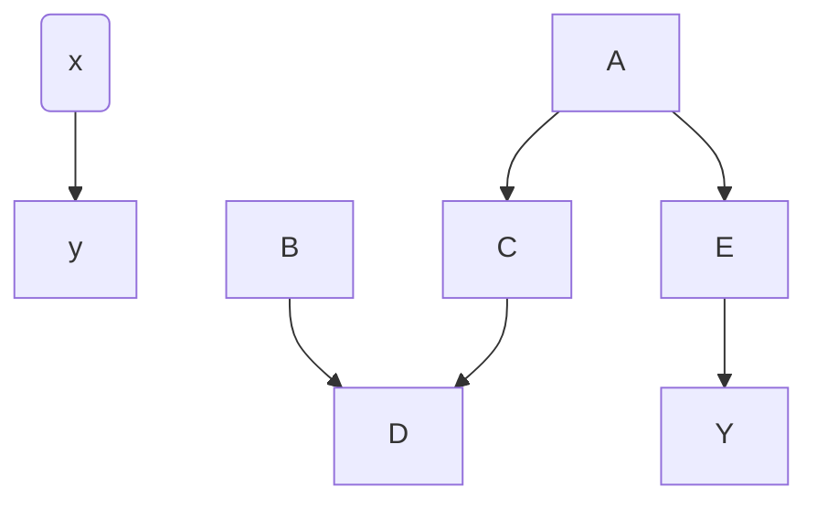

# Hello-World
Getting good at Flow
My Name is Mason and I'm finally going to make a mathematical textbook
Plus talking about running and yoga
 $\sqrt{3x-1}+(1+x)^2$

```mermaid
graph TD;
    f(x)-->y;
    A-->C;
    A-->E-->Y;
    B-->D;
    C-->D;
```
