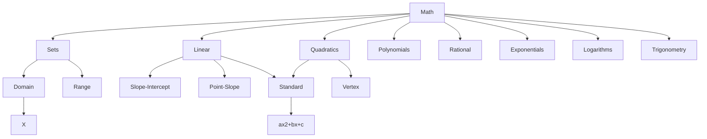

# Hello-World
Getting good at Flow
My Name is Mason and I'm finally going to make a mathematical textbook
Plus talking about running and yoga

Here is going to be the mapping of my book

```mermaid
graph TD;
    Math-->Sets;
         Sets-->Domain;
              Domain-->X;
         Sets-->Range;
    Math-->Linear;
         Linear-->Slope-Intercept;
         Linear-->Point-Slope;
         Linear-->Standard;
    Math-->Quadratics;
         Quadratics-->Standard;
                 Standard-->ax2+bx+c;
         Quadratics-->Vertex;
    Math-->Polynomials;
    Math-->Rational;
    Math-->Exponentials;
    Math-->Logarithms;
    Math-->Trigonometry;
```

